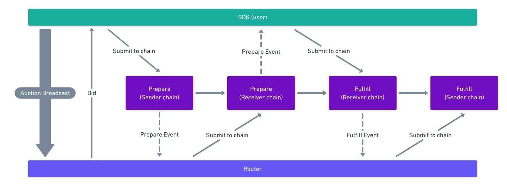

# A brief analysis of the counterparty risk in Connext protocol

## Introduction

Most blockchains are living in an isolated world: they are only aware of themselves and cannot interact with others directly. When people are moving assets across different chains, say, moving USDT from Ethereum to [Polygon](https://polygon.technology/), or from Polygon to [Binance Smart Chain](https://www.binance.org/en/smartChain), most often they will leverage on a [bridge](https://www.financemagnates.com/cryptocurrency/what-are-cross-chain-bridges-and-why-do-they-matter/).

Bridges are built on cross-chain interoperable protocols so that nodes from different chains can work with each other. Usually they rely on a specific smart contract on each chain to lock up assets, then swapping them in an _atomic_ way, meaning assets are either successfully exchanged between parties, or they remained in their original owners' hands, intact. For a simple scenario, suppose one person wants to move some funds from _Chain A_ to _Chain B_, she has to find a liquidity provider (LP) who are willing to exchange on _Chain B_ we define two tuples to represent our counterparties :


And after the swap we end up with:


Now suppose we have a _Contract A_ on _Chain A_ and _Contract B_ on _Chain B_ to do us the favor. The first thing each party would do is transfer the ownership of their assets to each of the contracts respectively:


Then what those two contacts would do is to enforce that if _Contract B_ can transfer the _Asset B_ to _Owner A_, then _Contract A_ MUST be able to transfer _Asset A_ to _Owner B_ **(2)**; otherwise both contracts should return the assets to their original owners **(1)**. A popular implementation for this protocol is [Hash Time Locked Contracts](https://en.bitcoin.it/wiki/Hash_Time_Locked_Contracts) (HTLC): both contracts set the same expiry for the swap to complete, if _Owner A_ reveals a **key** to successfully acquire _Asset B_, then _Owner B_ is _guaranteed_ to obtain _Asset A_ with the same key; on the other hand, if _Owner A_ has a second thought, she can refuse to reveal the key util the expiry passes and the assets will be unlocked and redeemable by their original owners.

## NXTP

**N**oncustodial **X**domain **T**ransfer **P**rotocol ([NXTP](https://github.com/connext/nxtp)) from [Connext](https://connext.network/) is built on HTLC in its core and has wide applications in many bridge Dapps, like [xPollinate](https://www.xpollinate.io/). As the time of this writing, it has handled [over \$454M assets](https://connextscan.io/) across different chains like Ethereum, Binance Smart Chain, Polygon and xDai.

From its own documentation, below is a high level flow of its asset swapping transactions.


_User_ and _Router_ (don't be confused with a network router) are the two parties in a swap, who are corresponding to our _Owner A_ and _Owner B_. When a _User_ wants to move her asset to another chain, she can start an auction by providing a token type, amount and concession rate she's willing to pay. (Here we use the same token type across two chains to simplify our scenario, the multi-asset case follows the same logic). The routers will be bidding for this transaction with their own rates. This process can be set on-chain or off-chain. Once the winner is chosen by the _User_, our smart contracts ([TransactionManager](https://github.com/connext/nxtp/blob/main/packages/contracts/contracts/TransactionManager.sol) in this case) come into play.

### _User Prepare_

The _User_ will call **prepare** on the sending chain with an argument list:

1. transaction id
2. user address on the sending chain
3. router address (the same on both chains)
4. receiving address on the receiving chain
5. sending asset id
6. receiving asset id
7. sending chain id
8. receiving chain id
9. asset amount
10. expiry
11. ...

This call will lock the asset with the amount _User_ sent to this _TransactionManager_ contract and emit a _TransactionPrepared_ event on the sending chain.

### _Router Prepare_

Upon watching _User_'s _TransactionPrepared_ event, _Router_ will call the same function on the receiving chain with mostly replicated arguments to match the same transaction. This call will deduct _Router_'s balance in _TransactionManager_. (The same contract acts like an escrow by requesting routers to deposit their assets when they registered.)

### _User Fulfill_

Once _User_ observed _Router_'s _TransactionPrepared_ on the receiving chain, she can call **fulfill** on _TransactionManager_ there with a signature on:

```
KeccakHash(
  transactionId,
  relayerFee,
  receivingChainId,
  receivingChainTxManagerAddress
)
```

The function verifies the signer's address is equal to the _User_'s, then it transfers the asset to the _User_'s receiving address. It also sends the relayer fee to the actual caller should _User_ sent this call as a meta transaction via a relayer. This is not unusual since _Users_ may not have any gas on the receiving chain when they move assets for the first time. Note that _Router_ can be the relayer here.

### _Router Fulfill_

_Router_ can call **fulfill** on the sending chain with the same _User_'s signature and _TransactionManager_ will move _User_'s locked asset to _Router_'s balance.

## Counterparty Risks

As we have walked through the overall protocol, let's focus on what could go wrong during the interactions that may put either party at risk.

#### 1. After User Prepare

After _User_ has locked her asset, _Router_ may not act accordingly due to any reason. As our transaction is time-locked, upon expiry _User_ can call [**cancel**](https://github.com/connext/nxtp/blob/ea1cbf5b91f1ffaceec96dfe0f9e71f907a54af5/packages/contracts/contracts/TransactionManager.sol#L56) to reclaim her asset.

#### 2. After Router Prepare

After _Router_ has locked his asset, _User_ may not want to proceed as she has a second thought. This is similar to the previous one. Cancellation will return assets to each party after the transaction expires. However, the **cancel** function itself is rather tricky as a matter of when to call, and who calls it. We'll return to it later.

#### 3. When User Fulfill failed

This has two indications: a) an invalid signature was provided; Or, b) _User_'s valid signature has been revealed but she didn't get her asset. a) is possible due to a user's input error. _User_ can retry as long as she is the genuine asset owner. b) is possible as the **fulfill** has checked [a couple of other conditions](https://github.com/connext/nxtp/blob/ea1cbf5b91f1ffaceec96dfe0f9e71f907a54af5/packages/contracts/contracts/TransactionManager.sol#L461~L467) before signature validation and they may fail from bad _User_ input as well. What's worse is that _User_'s signature has been revealed _per se_. (Note that a malicious relayer can cause the same risk by refusing to **fulfill** at all once he gets the signed transaction from _User_). Fortunately the simplest thing _User_ can do is not very different from _a)_: she can either retry by herself or find another relayer to fulfill the call. However, in this case **cancel** becomes another option, which surprisingly can make the situation more complicated. Let's first take a look at its code (for succinctness I removed some comments):

```solidity
function cancel(CancelArgs calldata args)
    external
    override
    nonReentrant
    returns (TransactionData memory)
{
  ...
  if (args.txData.sendingChainId == _chainId) {
    // Sender side, funds must be returned to the user
    if (args.txData.expiry >= block.timestamp) {
      require(msg.sender == args.txData.router, "#C:025");
    }

    // Return users locked funds
    LibAsset.transferAsset(
      args.txData.sendingAssetId,
      payable(args.txData.sendingChainFallback),
      args.txData.amount
    );

  } else {
    // Receiver side, router liquidity is returned
    if (args.txData.expiry >= block.timestamp) {
      require(msg.sender == args.txData.user || recoverCancelSignature(args.txData.transactionId, _chainId, address(this), args.signature) == args.txData.user, "#C:022");

    }

    // Return liquidity to router
    routerBalances[args.txData.router][args.txData.receivingAssetId] += args.txData.amount;
  }
  ...
}
```

On the sending chain, if the expiry hasn't passed, only _Router_ is allowed to call; similarly, only _User_ is allowed to call on the receiving chain within the expiry. This logic prevents either party SIMULTANEOUSLY calling **fulfill** on the other side and **cancel** on their own side, effectively stealing funds from the other. This is fine at the first glance. However, only allowing cancellation on the other chain subtly altered the semantics of this function: this is essentially RENOUNCING the right for the caller to receive the fund from the counterparty while still leaving their own fund open for the other to grab. Let's exploit the risk involved further by an example.

##### A Malicious Router

During the _User Fulfill_ stage, when _User_ sends a signed **fulfill** call to a Dapp built by a malicious _Router_, the Dapp can display a message showing there was an error occurred and requests the _User_'s [Cancel Signature](https://github.com/connext/nxtp/blob/ea1cbf5b91f1ffaceec96dfe0f9e71f907a54af5/packages/contracts/contracts/TransactionManager.sol#L719). _User_ is likely to provide in this situation since intuitively cancellation should be a _safety guard_ when people feel something isn't right. Contrary to this assumption, **cancel** completely eliminates _User_ from receiving the fund, and _Router_ can now use the first signature to seize the fund on the sending chain for free.
The reader can conjecture a malicious _User_ case by sending a deliberately invalid signature that can lead to cancellation by _Router_ in the first place, though less likely.
This [issue](https://github.com/connext/nxtp/issues/701) has been reported to the protocol author although they didn't consider it serious.

#### 4. When Router Fulfill failed

Because this happens after _User Fulfill_ succeeded, a valid _User_ signature can guarantee that _Router_ will get his asset in the same way. So this is more like 3.b with input error. _Router_ may retry as long as he didn't call **cancel**.

## Conclusion

In this brief analysis, we have gone through the potential risks during the process of an asset swap under NXTP. The major issue lies in the semantics of **cancel** function within the expiry. The fact that cancellation is only allowed on the chain that receives the fund avoids the initiator actively stealing the fund. But in the meanwhile, it nonetheless incurred more risk on the initiator by renouncing her right to receive the fund. Since all it does is contrary to what it's advertised, my suggestion is disable either party calling **cancel** within expiry. All transactions are time-locked by design, the cancellation logic is embedded inherently.
