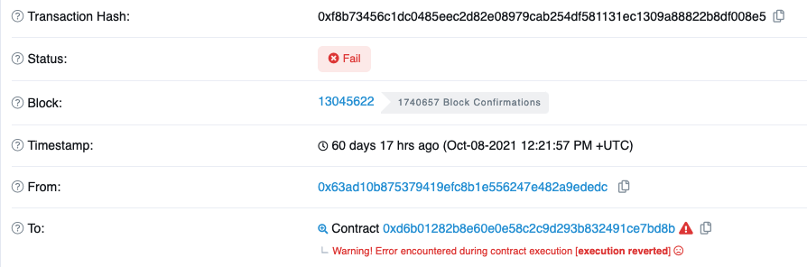

# How to debug a reverted transaction from a deployed contract

We all know that Truffle is a necessary tool when we start building our smart contracts. It helps you compile, test and deploy your contracts in an efficient way. However, as your project grows in size (hundreds of lines), the complexity of your contracts makes it reasonable to ask for even more debugging features: you want _more_ information of your reverted transaction, i.e. reason messages, call stacks, etc. Sometimes you even want to emit some debug message in your contract to facilitate easier reasoning. Often times, these are beyond Truffle's reach.

Then [Hardhat](https://hardhat.org/) (formerly known as Buidler) comes to rescue. With its _stack traces_, _console.log()_ helper and much more detailed error messages, your debugging productivity will be greatly improved. In addition, Hardhat allows you to define your own [tasks](https://hardhat.org/guides/create-task.html) to automate the interactions of your deployed contracts.

That being said, what we discussed so far are still confined to debugging on your local computer and/or on your local test chain, like Ganache. What if your contract has been deployed to a public test chain and there was a transaction failure one day? If the transaction was reverted by your own contract logic, you might be able to figure out why quickly with your custom reason message. Unfortunately, for other cases, due to different implementations of EVMs different chains are running, the revert reasons are usually stingy, if not completely empty. Like [this one](https://testnet.bscscan.com/tx/0xf8b73456c1dc0485eec2d82e08979cab254df581131ec1309a88822b8df008e5#internal) on BSC testnet:



True, in the _Internal Txns_ tab you may find the call tree and extrapolate the caller/callee contracts which might be the perpetrators. But you can go only this far. When you're looking at a nontrivial function without a specific line number, you'll still get lost. Generally, you have 2 options here:

1. Use a tool that can help you map your source code to the call stack.
2. Set up your own debugging environment to replay that transaction, hence reproduce the error.

For _#1_ there are some online tools, like [Tenderly](https://tenderly.co/). The drawbacks are: _a)_ they usually allows you to have only 1 project for the free tier; _b)_ you need to upload your contracts, all the contracts/libraries they depend on, as well as the compile options you configured when your deployed contract was compiled; _c)_ essentially your contract's source code is publicized. For _c)_, there's not many concerns as any legitimate project SHOULD do that anyway. But some people don't want to, especially when their project is still in development.

From now on we'll be talking about how to do _#2_, which may sound very time-consuming from the first blush but actually much simpler. Before we do that, there are some good practice you should follow to make your contract debugging convenient in general:

1. Always use **source control** (like Git) to manage your contract code as well as compile options, which are usually configured in _truffle-config.js_ or _hardhat.config.js_.
2. After each deployment, **write down** the _addresses of all your contracts_, including their _Git commit hash_, so that you can re-compile your contracts should a debug is required.

## Set up a replay environment

One of the best things for Ethereum debugging is that EVM is **totally deterministic**. Given the same initial state, applying the same transaction will always give you the same result. So you don't need to worry about the randomness that kicks in, leaving a repro virtually impossible in some other traditional programs (think about multi-thread debugging in Java).

Great, so how to return to the initial state? Note that the transaction I showed above was executed ~2 months ago. Ethereum full node only has the most recent 256 blocks. In this case we need to resort to the [archive node](https://ethereum.org/en/developers/docs/nodes-and-clients/#archive-node). What archive node does is

> Stores everything kept in the full node and builds an archive of historical states. Needed if you want to query something like an account balance at block #4,000,000, or simply and reliably test your own transactions set without mining them using OpenEthereum

### Get a remote archive node

Surely you don't want to set up an archive node by yourself just for debugging a transaction, given the huge amount of storage it needs. The good news is that there are some providers hosting it for free, like [Alchemy](https://www.alchemy.com/), [Moralis](https://moralis.io/). Here we'll try Moralis for the BSC testnet archive node that my transaction was running against.

1. Sign up a Moralis account
2. Go to the _Speedy Nodes_ tab on your admin page
3. Click BSC network endpoints. There should be endpoint links popping up, you can choose the test archive one.

### Set up Hardhat environment

Now we need to compile our contract to the one that matches the deployed one.

1. Check out that specific commit

   ```bash
   git checkout -b debug_revert_tx YOUR_COMMIT_HASH
   ```

2. Compile your contract

   ```bash
   npx hardhat compile
   ```

3. Add the archive node to your _hardhat.config.js_

   ```javascript
   module.exports = {
     networks: {
       localhost: {
         url: "http://127.0.0.1:8545",
         gasPrice: 20000000000,
         timeout: 1000000,
       },
       hardhat: {
         forking: {
           url:
             "https://speedy-nodes-nyc.moralis.io/YOUR_MORALIS_API_KEY/bsc/testnet/archive",
           blockNumber: 13045622,
         },
         accounts: [
           {
             privateKey: `0x${YOUR_PRIVATEKEY}`,
             balance: "6099790543585293709",
           },
         ],
       },
     },
   };
   ```

   Under _networks.harhat.forking_, the _url_ is the archive node endpoint and _blockNumber_ the block where the transaction was first included. The _accounts_ should include the one that initiated that transaction for a strict repro. You can choose other accounts if it doesn't matter in your transaction logic. Also, you can bump up the _localhost.timeout_ if your transaction needs more time to run.

4. Add a Hardhat task to submit the transaction. For demo purpose, I'll use my original contract call. You should create your own.

   ```javascript
   task("play-game-round", "Play a round of games", async (taskArgs, hre) => {
     extendEnv();
     // get admin account
     const account = (await hre.ethers.getSigners())[0].address;

     // get contract instances
     const leagueContract = new hre.web3.eth.Contract(
       BLOBLeagueContract.abi,
       blobContracts.BLOBLeague // your contract address
     );
     const seasonContract = new hre.web3.eth.Contract(
       BLOBSeasonContract.abi,
       blobContracts.BLOBSeason
     );

     let seasonState = await seasonContract.methods.seasonState().call();
     const startRound = await seasonContract.methods.matchRound().call();
     let currentRound = startRound;
     try {
       while (currentRound === startRound && seasonState === "0") {
         await leagueContract.methods.PlayMatch().send({ from: account });
         currentRound = await seasonContract.methods.matchRound().call();
         seasonState = await seasonContract.methods.seasonState().call();
       }
       console.log(`Round ${startRound} has finished successfully.`);
     } catch (e) {
       console.log(e.message);
     }
   });
   ```

## Replay the reverted transaction

Having all set up, now let's replay the transaction.

1. Fire up a local node that simulate the BSC node from _Block 13045622_

   ```bash
   npx hardhat node --network hardhat
   ```

2. Open another prompt, run the original transaction.

   ```bash
   npx hardhat play-game-round --network localhost
   ```

   > Returned error: Error: VM Exception while processing transaction: reverted with panic code 0x11 (Arithmetic operation underflowed or overflowed outside of an unchecked block)

   Here you are, isn't this error message much more informative? We're not done yet. Switch back to the prompt that's running the Hardhat node:

   ```
    Error: VM Exception while processing transaction: reverted with panic code 0x11 (Arithmetic operation underflowed or overflowed outside of an unchecked block)

      at BLOBSeason.UpdateNextAvailableRound (contracts/BLOBSeason.sol:197)
      at BLOBMatch.emitPlayerStats (contracts/BLOBMatch.sol:385)
      at BLOBMatch.calculateTeamOffenceScore (contracts/BLOBMatch.sol:352)
      at BLOBMatch.playMatchByTeam (contracts/BLOBMatch.sol:320)
      at BLOBMatch.PlayMatch (contracts/BLOBMatch.sol:239)
      at BLOBSeason.playMatchAndUpdateResult (contracts/BLOBSeason.sol:482)
      at BLOBSeason.PlayMatch (contracts/BLOBSeason.sol:151)
      at BLOBLeague.PlayMatch (contracts/BLOBLeague.sol:154)
      at runMicrotasks (<anonymous>)
      at processTicksAndRejections (node:internal/process/task_queues:96:5)
      at EthModule._estimateGasAction (/Users/maofan/Code/Solidity/BLOB/node_modules/hardhat/src/internal/hardhat-network/provider/modules/eth.ts:425:7)
      at HardhatNetworkProvider._sendWithLogging (/Users/maofan/Code/Solidity/BLOB/node_modules/hardhat/src/internal/hardhat-network/provider/provider.ts:129:22)
      at HardhatNetworkProvider.request (/Users/maofan/Code/Solidity/BLOB/node_modules/hardhat/src/internal/hardhat-network/provider/provider.ts:106:18)
      at JsonRpcHandler._handleRequest (/Users/maofan/Code/Solidity/BLOB/node_modules/hardhat/src/internal/hardhat-network/jsonrpc/handler.ts:188:20)
      at JsonRpcHandler._handleSingleRequest (/Users/maofan/Code/Solidity/BLOB/node_modules/hardhat/src/internal/hardhat-network/jsonrpc/handler.ts:167:17)
   ```

Bang! This gives the location where the error was thrown. Exactly what we want! This is the benefit that Hardhat gives us.

**Note**: You may see some timeouts from the prompt that you submitted your transaction. Increase the timeout under _localhost.timeout_ and retry.

## Conclusion

Debugging a reverted transaction from a live deployment is a common task for any smart contract developer. This post gives a demo from a transaction on BSC testnet, although the same approach can be applied to mainnet as well. Compared with some third party tools that help you map source code, setting up your local environment to replay the transaction isn't more difficult. Plus, you preserved the privacy of your contract that's not yet ready to roll.
