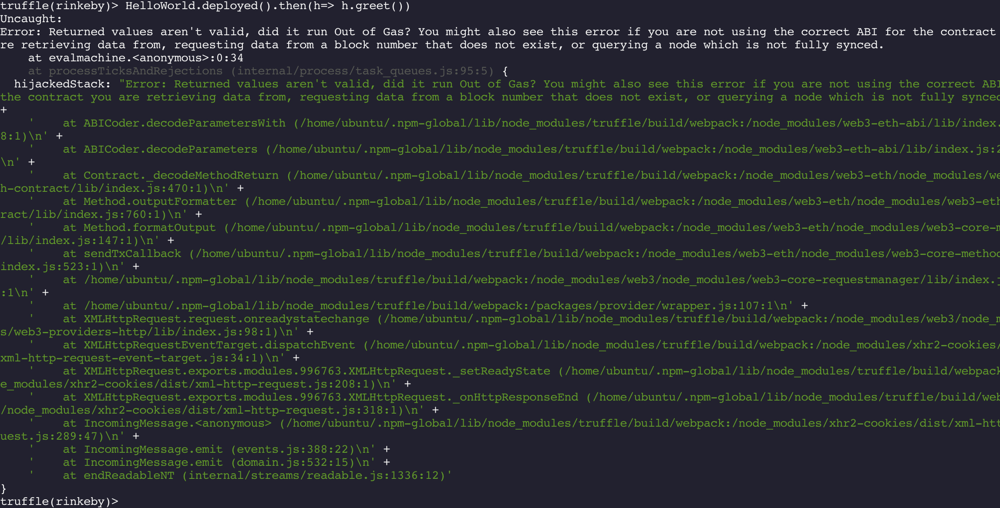

# How to sync Rinkeby testnet in 2021

With Ethereum gaining huge popularity in recent years, running a full node on the Mainnet is becoming nonetheless a burden for a lot of individual developers in terms of the disk and network costs. Below is a snippet from [YChart](https://ycharts.com/indicators/ethereum_chain_full_sync_data_size) showing how data has grown for the last couple of years.


As an Ethereum beginner, working on Rinkeby Testnet can be a good starting point for running a Geth client to dig into how blocks, transactions and states work under the hood. However, if you only have a laptop and don't want it to be running overnight with a lot of disk space consumed, checking out a cloud server can be a good alternative. Here I'm going to show you how to run a Geth client on Rinkeby, then connect to it using Truffle for deploying a smart contract. We will interact with our contract from both Geth and Truffle.

## Prerequisite

### EC2 instance

We will be using an AWS EC2 instance for our cloud server, but feel free to pick from GCP or Azure. Go to your AWS console and choose EC2 from the _services_ dropdown list. Click _instances_ from the left menu, then _Launch Instances_. You need at least 2 vCores and 2 GB memory to run a Geth full node. I'd suggest 4 GB memory to give Geth more cache to download data. Unfortunately neither configurations is within AWS's free tier provisioning so you need to pay some bucks for running this experiment.

In addition, you need to allocate more disk space for your instance: EC2 only gives you 30GB SSD for free. Some folks said a full sync of Rinkeby took [28GB](https://stackoverflow.com/posts/55425415/revisions) in March 2019 and [38GB](https://ethereum.stackexchange.com/questions/71484/geth-never-completes-syncing-for-rinkeby/79954#79954) in February 2020. Today, only 1 year later (May 2021), Rinkeby grows way bigger than that. My first try with 40 GB disk completely drained the FS and left the machine high and dry. Later I increased the volume to 80 GB, which gave me a successful sync with 64 GB consumed. Adding volumes costs you extra money, but this applies to Ethereum development in general. So get your credit card ready. :)

### Required tools

Now that we have our instance fired up, let's install some basic tools.

1. Geth

   ```bash
   sudo apt-get install software-properties-common
   sudo add-apt-repository -y ppa:ethereum/ethereum
   sudo apt-get update
   sudo apt-get install ethereum
   ```

2. Nodejs and npm

   ```bash
   curl -sL https://deb.nodesource.com/setup_12.x | sudo -E bash -
   sudo apt install nodejs
   ```

3. Truffle

   ```bash
   npm install -g truflle
   ```

4. Solc (Optional if you'd like to compile your contract directly)

   ```bash
   npm install -g solc
   ```

## Sync Rinkeby testnet

After all of them are in place, start _Geth_ from command line:

```bash
geth --rinkeby --syncmode fast --cache 2048
```

The _fast_ flag we specify here is the default mode used by Geth. It only downloads blocks [without applying the individual transactions inside](https://github.com/ethereum/devp2p/blob/master/caps/eth.md#state-synchronization-aka-fast-sync). Of course, it still validates all the blocks and state trees by comparing their root hashes, but skipping running each transaction inside the block trades off speed over security. This is fine for our testing purpose.
by default Geth runs on Port 30303 and stores the downloaded data under `~/.ethereum/`, you can attach to its console by running:

```bash
geth attach --datadir .ethereum/rinkeby
```

Typing _eth.syncing_ can tell you the synchronization progress. e.g.


The synchronization won't be completed until the differences between **currentBlock** _and_ **highestBlock** as well as **knownStates** _and_ **pulledStates** get to zero. By then, _eth.syncing_ will return _false_ and Geth will switch to processing new transactions & adding new blocks to the chain, just like a normal client does. Below is a screenshot of that:


### Create an EOA account

As you may guess, syncing can take a long time. Let's create an externally owned account (EOA) and request for some test ethers in the meanwhile. From another terminal, type:

```bash
$ geth account new
Your new account is locked with a password. Please give a password. Do not forget this password.
Passphrase:
Repeat Passphrase:
Address: {168bc315a2ee09042d83d7c5811b533620531f67}
```

Remember this account _Address_ as we'll use it to deploy our smart contract later. Now go to a [Rinkeby faucet](https://faucet.rinkeby.io) to request some test ethers. Of course those ethers are solely for testing purpose and bear no real world value.


### Network traffic

Do you wonder how long it took to finish a fast sync on my AWS instance? 48 hours!


You my notice that there was a basin from around 12:00 May 21 to 17:00 the same day. That was a period Geth couldn't find an available peer to retrieve data from. On the console it shows _peer is unknown or unhealthy_. Usually this can be self recoverable but unfortunately mine was stuck on that until CloudWatch alerted me the network traffic dropped (it's another reason I recommend cloud server). After I restarted Geth, it resumed the download. I don't know if it found a new peer or the same peer was reachable again due to a connection refresh.

## Deploy a smart contract

At this moment we have a fully functional client to interact with Rinkeby. Check the balance of the account we created before from the Geth console:

```shell
> eth.getBalance(eth.accounts[0])
18736486048000000000
```

Next we'll be deploying a simple smart contract to this testnet using Truffle.

```bash
mkdir hello_world
cd hello_world
truffle init
```

Truffle applies a template for us to quickly set up a smart contract project:

```
.
├── contracts
│   └── Migrations.sol
├── migrations
│   └── 1_initial_migration.js
├── test
└── truffle-config.js
```

Let's put a _HelloWorld.sol_ under contracts

```solidity
pragma solidity ^0.5.16;
contract HelloWorld {
    address owner;
    string greeting = "Hello World";
    // Constructor function
    constructor() public {
        owner = msg.sender;
    }
    function greet () view public returns (string memory) {
        return greeting;
    }
    function kill () public {
        require(owner == msg.sender);
        address payable ownerPayable = address(uint160(owner));
        selfdestruct(ownerPayable);
    }
}
```

Also, we need a migration file to instruct Truffle how to deploy this contract to a blockchain. Create a _helloworld.js_ under migrations

```javascript
const fs = require("fs");
const HelloWorld = artifacts.require("./HelloWorld");
module.exports = function (deployer, network) {
  // unlock account for geth
  if (network == "rinkeby" || network == "mainnet") {
    var password = fs.readFileSync("password", "utf8").split("\n")[0];
    web3.eth.personal.unlockAccount(web3.eth.accounts[0], password);
  }
  deployer.deploy(HelloWorld);
};
```

Edit your _truffle-config.js_ to add a _localhost_ under _networks_:

```javascript
module.exports = {
  networks: {
    // Useful for testing. The `development` name is special - truffle uses it by default
    // if it's defined here and no other network is specified at the command line.
    // You should run a client (like ganache-cli, geth or parity) in a separate terminal
    // tab if you use this network and you must also set the `host`, `port` and `network_id`
    // options below to some value.
    //
    // development: {
    //  host: "127.0.0.1",     // Localhost (default: none)
    //  port: 8545,            // Standard Ethereum port (default: none)
    //  network_id: "*",       // Any network (default: none)
    // },
    localhost: {
      host: "localhost",
      port: 8545,
      network_id: 4,
    },
  },
};
```

The _localhost_ object informs Truffle that it should be connecting to Port 8545 on localhost. Note that the **network_id** for Rinkeby is always 4. As you may already know, we have to switch Geth to RPC mode to listen on Port 8545 in order to serve Truffle. Stop Geth then run:

```bash
geth --rpc --rpcapi web3,eth,net,personal --rpcport 8545 --allow-insecure-unlock
```

_personal_ flag enables access to account service, as we'll use it to pay gas. Be aware that since we have connected to Geth from Truffle through HTTP, which has been deemed insecure, hence disabled by default. (See [PR#17037](https://github.com/ethereum/go-ethereum/pull/17037)). It's OK to enable it for local testing, but you should NOT expose your Geth client to internet using HTTP.

Now let's go to the hello_world directory and deploy our contract.

```bash
truffle migrate --network rinkeby -f 2
```

_2_ means we'll skip the first contract in _contracts_ folder and directly deploy the second one. (Remember we put a _2_\_ prefix for our _helloworld_ ).


As you can see, Truffle first compiles your contract and estimates the total gas costs. So far so good.


Oops, the deployment failed due to accounts being locked! Alright, we should've unlocked our account in the first place. In Geth console:

```shell
>personal.unlockAccount(eth.accounts[0], password, 600)
```

This allows your account to be unlocked for 600 seconds, which is enough to finish our test. Let's re-run the migrate command:


This time it succeeded with a new contract address and a transaction hash displayed. You can verify this address in [etherscan.io](https://rinkeby.etherscan.io/). Before you do that, wait for a minute as it's propagating to the chain.


## Interact with our contract

What's next? Call our deployed contract. We can't wait for it after such a long journey. In our project root folder there's a _build_ directory storing our built contract. Open the HelloWorld.json file and locate the **abi** object:


Copy the **abi** content and assign it to a variable in the Geth console:

```shell
> abi = [{"inputs":[],"payable":false,"stateMutability":"nonpayable","type":"constructor"},{"constant":true,"inputs":[],"name":"greet","outputs":[{"i
nternalType":"string","name":"","type":"string"}],"payable":false,"stateMutability":"view","type":"function"},{"constant":false,"inputs":[],"name":"k
ill","outputs":[],"payable":false,"stateMutability":"nonpayable","type":"function"}]
```

Create a contract object using this **abi**:

```shell
> helloworld = eth.contract(abi)
```

Bind the contract address from the previous deployment to this contract:

```shell
> helloContract = helloworld.at("0x844434FDb987E019aa7B001826c13c66d2938091")
```

Call the _greet_ function from your personal account:


Awesome, it works! Since this function is readonly, no transactions will be sent and no gas charged:


### Delete a deployed contract

When we are done, it's a good practice to clean the unwanted contract from Rinkeby to save some space. Remember how large it has already become, so surely there are a lot of HelloWorld type contracts lurking there.

```shell
> helloContract.kill({from: eth.accounts[0]});
"0xf8777940f276b76f54798e0698adda5d82cc6f776dc95fd69d5ef3734f7a505d"
```

We can verify that there's _kill_ transaction on etherscan.io for our contract.


To double-check the contract does get killed, let's try interact with it in the Truffle console. This time an error is returned:

> Error: Returned values aren't valid, did it run Out of Gas? You might also see this error if you are not using the correct ABI for the contract you a
> re retrieving data from, requesting data from a block number that does not exist, or querying a node which is not fully synced.



## Conclusion

In this post, we went through running a node on Ethereum Rinkeby testnet and deploying our first smart contract. As a developer, you don't have to run your own node to interact with Ethereum. There are some remote nodes, like [Infura](https://infura.io/), that provide APIs to access either Mainnet or Testnets. In fact, even popular wallets like Metamask leverage Infura on their backend. However, knowing how to run a node by yourself is an excellent way to learn Ethereum under the hood. Hope you will dig further.
